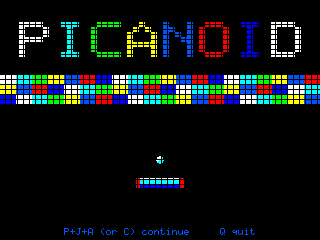
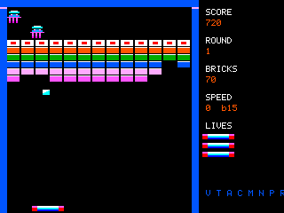
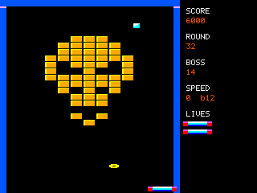

# Picanoid for the PicoMite — player's guide

A bat-and-ball brick game for the PicoMite, in the style of the 1980s
originals. **This is a test build and we would like to know where it does not
behave.**

The title screen and every sound in it are original work. The playfield
artwork and the thirty-two screen layouts are still derived from a
disassembly of the BBC Micro game this began as, and are being replaced —
see *What is still derived* at the end.



*The title screen, drawn from the same bricks the game is made of.*



*Round 1. The top row is silver and takes two hits; the ball has eaten into
the bottom two rows.*

## What you need

- A PicoMite running **MODE 2** — 320 × 240, 16 colours — on an RP2350. The
  brick field is a `TILEMAP`, which is RP2350 only.
- Firmware **V6.03.02b8 or later**.
- **A mouse.** The bat follows it. Keys will not do: this is a spinner game
  and the mouse is the spinner.
- **One** image slot free. The bricks, every sprite and the title screen are
  a single image. On a board with PSRAM (the PicoComputer 3 has it) running
  6.03.02b11 or later it is loaded into **RAM slot 1** at every start, which
  takes a few tens of milliseconds and leaves the flash alone entirely.
  Otherwise it is written into **flash slot 1** the first time you run the
  game and checked — not rewritten — after that. Flash slots 2 and 3 are
  left alone either way, so a `LIBRARY` and this game can live together.

## Loading it

Copy the whole **`picanoid`** directory to the board, keeping the files
together, and

```
RUN "picanoid.bas"
```

| | |
| --- | --- |
| `picanoid.bas` | the game |
| `pic_art.bmp` | the bricks, every sprite and the title screen |

It finds its own artwork beside itself with `MM.INFO(PATH)`, so the directory
can sit anywhere on any drive — `A:/picanoid`, `B:/games/picanoid`, wherever
you keep things. A program typed in rather than loaded has no path, and then
it looks in the root of `A:`.

It sets its own display — 640 × 480 at 315 MHz, which is **75 Hz** — and then
`MODE 2`. That refresh is not an accident: 75 is exactly one and a half times
the BBC's 50 Hz, the only rate this machine can produce that divides cleanly,
so every speed in the game comes out at the rate it had in 1986.

## Controls

| | |
| --- | --- |
| **mouse** | move the bat |
| **left button** or **SPACE** | launch the ball; fire, when you have the laser |
| **DELETE** | pause |
| **Q** | quit |

At the title screen, **SPACE** starts a game and **C** continues from the round
you last reached. On a machine with a real keyboard, holding **P**, **J** and
**A** together does the same thing — that is the original's own cheat, and it
is in the game code, not in the crack.

## What you are trying to do

Clear every destructible brick on the screen, thirty-two times. Then it starts
again.

The ball is not lost when it passes the bat — it is lost when it drops off the
bottom. You have three lives and gain one every 50,000 points.

## The bricks

| | |
| --- | --- |
| **Coloured** | one hit. Worth 50 to 120 depending on the colour. |
| **Reinforced** | the one with a solid white ring round a red core — you cannot mistake it. **Two hits in rounds 1–8, three in 9–16, four in 17–24, five in 25–32.** Worth 100. |
| **Solid** | the amber one with the yellow top. Indestructible, worth nothing, and it does not count towards clearing the screen. |

## The capsules

An ordinary brick sometimes drops one. **Only an ordinary brick** — never
silver, never gold, and never while you already have extra balls in play. Only
one falls at a time, and catching one is worth **1,000**.

Catching a capsule **cancels whatever you had before it**. You never hold two.

| | | |
| --- | --- | --- |
| **G** | green | **Grab.** The ball sticks to the bat where it lands. Fire to release it, or wait three seconds. |
| **D** | cyan | **Disruption.** Three balls. No capsule will drop until you are back to one. |
| **E** | blue | **Enlarge.** A wider bat. |
| **S** | yellow | **Slow.** Drops the ball one speed step. |
| **L** | red | **Laser.** Fire shoots up the screen. One shot at a time — but a well-placed shot takes out **two** bricks side by side. |
| **B** | white | **Break.** Opens a door in the right-hand wall. Drive the bat into it and the round ends for **10,000**. |
| **P** | white | **Player.** An extra life. |

**B and P are four times rarer than the others**, and the same capsule never
appears twice running.

## The enemies

Two at a time, no more. They come in through whichever of the two doors is
**furthest from your bat**, drift down through the field, and vanish if they
get too low. Worth 100 each, and you can kill them with the bat, the ball or
the laser. A ball that kills one bounces off it.

## How the ball speeds up

Not on a timer — on a count. **Every 180 brick contacts the ball moves up a
speed step**, four steps in all. Catching **S** puts it back one.

**Losing a life resets it to the slowest step**, and takes the bat back to
normal width. That is the original's design and it is a real mercy on the
later rounds.

## The one piece of strategy worth knowing

The bat has six zones, and where the ball hits decides both its angle *and its
speed*.

- **The outer edges** send it away fast and shallow — up to about two thirds
  faster than a centre return.
- **The middle** returns it slowly and steeply.

So a panicked stab with the end of the bat gets you a ball that is harder to
get back. When you are in trouble, try to meet it with the middle.

## Round 32 is the boss



The last screen is a face built entirely out of solid bricks, and there is
nothing on it to destroy. Hit it **twenty times** — anywhere — at 1,000 a
time. It throws things back at you while you do, and one of them reaching
your bat costs a life. They come about one a second and they are lethal, so
keep moving.

## Scoring

| | |
| --- | --- |
| Coloured brick | 50 – 120 |
| Reinforced brick, when it finally breaks | 100 |
| Alien | 100 |
| Capsule caught | 1,000 |
| Hit on DOH | 1,000 |
| Escaping through the Break door | 10,000 |
| Extra life | every 50,000 |

## Testing shortcuts

This build still has its development harness in it. At any point during play:

| | |
| --- | --- |
| **N** / **P** | next / previous round |
| **Z** | jump to round 32, DOH |
| **C** | drop a capsule on your bat, cycling through all seven |
| **A** | auto-bat — the bat plays itself |
| **M** | mute |
| **R** | restart the round |
| **S** | screenshot, saved beside the game |
| **G** | force a game over |
| **V T K E X Y D W** | the built-in self-tests: velocities, a 1500-frame soak, the capsule roll, effects, aliens, the boss, a death and the sounds |

## What is knowingly missing or unconfirmed

- **The escape door and the end-of-round dissolve are interpretations.** The
  original drew the door by XOR-plotting two halves without erasing them, and
  ran the dissolve by strobing the background colour while writing the video
  chip's palette register directly. Neither transfers to this hardware, and
  nobody has yet watched the original run to see what they looked like.
- **The playfield background is black.** In the original it is a colour that
  cycles every four rounds. That is read out of the data but not yet applied,
  for the same reason.
- The attract mode does not play a demo.

## What is still derived

Being straight about provenance, because it is being worked through in
stages:

- **Original to Picanoid:** every line of the code, the title screen, all
  eleven sound envelopes and all seventeen sound effects, the starting
  high-score table, and **all of the artwork** — bricks, bat, ball, aliens,
  capsules, the laser and the explosions are drawn by
  `Bas/ark_tools/gen_assets.py`, not unpacked from anything.
- **Still derived:** the **thirty-two screen layouts**, and the rules that
  give the game its shape — how many hits a reinforced brick takes, how the
  capsules are rolled, what things are worth, and when the ball speeds up.
  The motion tables themselves are ours.
