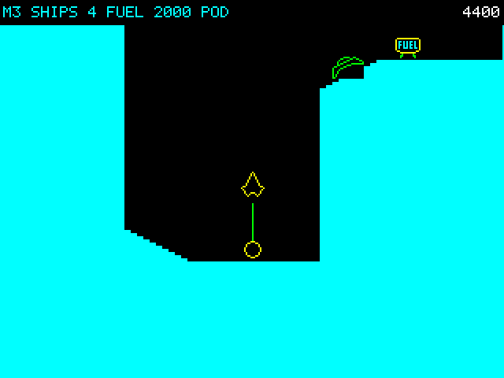

# Thrust for the PicoMite — player's guide

A port of Jeremy C. Smith's *Thrust* (Superior Software, 1986) for the BBC
Micro. The flight model, the levels, the artwork and the sound are the
original's own numbers, taken out of the published disassembly, so it should
fly exactly as it did in 1986. **This is a test build and we would like to
know where it does not.**

*Mission 3: the pod under tow on its tether, a limpet gun on the ledge above,
and a fuel cell waiting.*

## What you need

- A PicoMite running **MODE 2** — 320 × 240, 16 colours. Any VGA or HDMI
  build, or a 320 × 240 LCD panel that supports `FRAMEBUFFER`.
- Firmware **V6.03.02b6 or later**. The sound is the BBC's own, played
  through `PLAY BBC SOUND`, which arrived in that version.
- A keyboard. Several keys need to be *held*, so a joystick will not do.

## Loading it

`Bas/thrust.bas` in the PicoMite repository. Copy it to the board and `RUN`,
or `SAVE` it and `RUN` from flash. It is about 76 KB of BASIC, so give it a
moment to load.

## Controls

| | |
| --- | --- |
| **← →** or **Z X** | turn |
| **↑** or **SPACE** | thrust |
| **RETURN** or **A** | tractor field — also refuels; blocks the gun |
| **↓** or **F** | fire |
| **ESC** | back to the title screen |

## The first thing to do, because it is not obvious

**You start with an empty tank.** That is the original's design, not a fault:
the ship is put down directly above the first fuel cell. So —

1. Press SPACE at the title screen. You will fall.
2. **Hold RETURN** as you drop. A line snaps to the fuel cell and the fuel
   counter climbs fast.
3. Now thrust, and fly.

Each fuel cell is a fixed ration. Sit on the beam for about a second and the
cell is used up, worth 30 points and roughly twenty seconds of thrust.

## What you are trying to do

Lift the **Klystron pod** off its stand and carry it up out of the cave.

- Fly down to the pod and **hold RETURN** until the beam appears, then **pull
  away**. The pod lifts off as the line goes taut. It is not a grab — it is a
  tow.
- The pod hangs on a tether and swings. Thrust across the tether sets it
  swinging and thrust along it does not, and a swing does not stop on its own
  — you have to fly it out. Everything you thrust with the pod aboard is at
  half power.
- Fly up out of the top of the cave and the mission is complete.
- **Leaving without the pod costs you a ship.** There is a `NO POD — TURN
  BACK` warning in the panel before you cross the line.

The **reactor** is worth 2000 points. Shoot it fifty times and the planet goes
with it — and you have ten seconds to get clear, counted down in the panel. It
is the difference between a 2000-point mission and a 4000-point one.

Limpet guns are bolted into the rock and shoot at you. They are worth 75 each,
fuel cells 15 if you shoot them instead of drinking them.

Anything touching the rock destroys you — the ship, and the pod you are
towing. There is no landing in Thrust.

## The tractor field is a mode, not a shield

One key does the field, the refuelling and the bubble. While you hold it:

- You cannot fire.
- It burns fuel.
- You are drawn as a circle, which is **wider than the ship in both
  directions**, so it fouls the rock sooner than the hull does.

It does not make you invulnerable. It looks as though it should, and the
disassembly calls it a shield, but nothing in the original's code protects you
while it is up. If you are certain the real game behaves otherwise, please say
so — that is exactly the sort of thing we want to hear.

## Six caves, then round again

`mission = 1` is the first cave and they cycle after six. Each time round, the
guns fire harder, and after the first six:

- **missions 7–12** — gravity is reversed
- **missions 13–18** — the cave is invisible
- **missions 19–24** — both at once

You get four ships. The high score is kept in `A:/thrust.hi` and survives a
reset.

## Testing shortcuts

These are not part of the game; they are there so you can reach things without
playing to them.

| | |
| --- | --- |
| **N** | complete the mission — the only way to reach the later caves |
| **P** | swap the cave under you |
| **G** | full tank, and the pod already on the tether |
| **S** | screenshot to `A:/thrust.bmp` |
| **B** | frame-time benchmark, every level, about 45 seconds |

## What we would most like to know

1. **Does it fly like Thrust?** The turn rate, the thrust response, the
   feel of the pod on the tether. All of that is the original's arithmetic
   and it has been checked number by number, but nobody has compared it
   against the real thing side by side.
2. **Is the first refuel findable** without being told? It is the one moment
   where the game explains nothing.
3. Anything that stutters, and what was happening when it did.

## What is knowingly missing

- The rock is a solid colour. The BBC drew it on alternate pixel rows, which
  gave it a texture; ours is cheaper and plainer.
- No demo mode, no name entry for the high score.
- Collision is eight points around the ship's outline rather than per-pixel,
  so a very near miss may read differently from the original.

## Credit

*Thrust* by Jeremy C. Smith, Superior Software, 1986. This port is built on
the reverse-engineered source published by Kieran HJ Connell at
<https://github.com/kieranhj/thrust-disassembly>, without which it would not
have been worth attempting — the three technical references in that repository
are the reason the physics is the original's and not an imitation of it.
